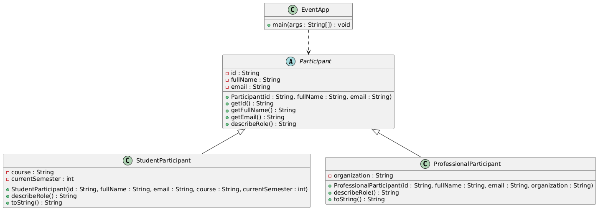

# Prova Prática de Programação Orientada a Objetos

Você integrará a equipe responsável por organizar a **IDP Tech Week**, uma semana de atividades acadêmicas. A coordenação precisa de um módulo simples em Java que represente participantes do evento e permita manipular essas informações em uma classe principal.

## Organização dos arquivos
- Dentro de `challenges/08-event/submissions/`, crie um diretório com o seu nome (`nome-sobrenome/`).
- Coloque todo o código-fonte dentro de `src/` (sem necessidade de pacotes) utilizando os nomes de classes indicados.

## Especificação técnica
Implemente o sistema seguindo as partes abaixo. Priorize o essencial para uma aplicação funcional e bem organizada.



### Parte 1 — Modelo de participantes
1. Crie a classe abstrata `Participant` (sem pacote) com atributos privados `id` (`String`), `fullName` (`String`) e `email` (`String`).
2. Implemente um construtor que receba esses dados e atribua aos atributos internos.
3. Disponibilize os métodos de leitura `getId()`, `getFullName()` e `getEmail()`.
4. Defina o método abstrato `public String describeRole()` para que as subclasses descrevam o papel do participante.
5. Implemente as subclasses concretas:
   - `StudentParticipant` com atributos adicionais `course` (`String`) e `currentSemester` (`int`).
   - `ProfessionalParticipant` com atributo adicional `organization` (`String`).
6. Cada subclasse deve sobrescrever `describeRole()` e fornecer um `toString()` legível com as principais informações.

### Parte 2 — Classe principal (40 pts)
1. Crie a classe `EventApp` com o método `public static void main(String[] args)` no mesmo pacote.
2. No `main`:
   - Crie uma coleção (por exemplo, `ArrayList`) para armazenar instâncias de `Participant`.
   - Cadastre manualmente ao menos dois estudantes e dois profissionais.
   - Percorra a coleção exibindo o `toString()` e o resultado de `describeRole()` para cada participante.
3. Mantenha o código organizado em métodos auxiliares se necessário, sem necessidade de interface interativa com o usuário.

## Entrega
- Valide a compilação completa do projeto antes de submeter.
- Faça commit das alterações no seu repositório fork/clonado.
- Abra um pull request para o repositório principal.
- Submeta o link do pull request no ambiente virtual.

## Testes automatizados
- Os arquivos de teste JUnit estão em `challenges/08-event/test/` e podem ser utilizados.
- As bibliotecas necessárias devem ser salvas em `challenges/08-event/lib/` antes da execução (o repositório não inclui os `.jar`).
- Para executar os testes com a sua solução:
  ```bash
  cd challenges/08-event
  mkdir -p lib
  curl -L -o lib/junit-platform-console-standalone-1.11.4.jar https://repo1.maven.org/maven2/org/junit/platform/junit-platform-console-standalone/1.11.4/junit-platform-console-standalone-1.11.4.jar
  javac -d bin/app $(find submissions/<seu-diretorio>/src -name "*.java")
  javac -cp "lib/junit-platform-console-standalone-1.11.4.jar:bin/app" -d bin/test $(find test -name "*.java")
  java -jar lib/junit-platform-console-standalone-1.11.4.jar -cp bin/app:bin/test --scan-class-path
  ```
- Substitua `<seu-diretorio>` pelo diretório criado dentro de `submissions/` com o seu nome.
