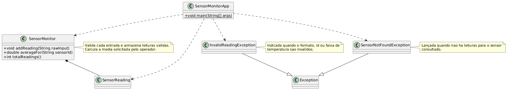

### Tratamento de Exceções

Nesta atividade você praticará o tratamento estruturado de erros construindo um pequeno monitor que lê leituras digitadas no terminal, valida os dados e responde com mensagens claras quando algo sai errado.

---

#### Cenário

Durante a manutenção, técnicos digitam as leituras de temperatura de cada sensor em um console. O monitor deve:

1. Receber leituras no formato `SENSOR_ID;TEMPERATURA_EM_CELSIUS` até que o operador digite `FIM`.
2. Validar o formato da linha, garantir que o identificador não esteja vazio e que a temperatura seja um número dentro da faixa **-30 °C a 55 °C**.
3. Informar quando uma leitura é inválida utilizando uma exceção personalizada.
4. Permitir consultar a temperatura média de um sensor informado pelo usuário, lançando uma exceção se não houver leituras para ele.

---

#### Especificação

1. Crie um `Scanner` para ler entradas linha a linha.
2. Dentro de um laço, leia as leituras até que o usuário informe `FIM` (ignorando diferenças de maiúsculas e minúsculas).
3. Para cada leitura:
   - Use `SensorMonitor#addReading` para validar e armazenar.
   - Caso a validação falhe, capture `InvalidReadingException` e informe o motivo para o operador, sem encerrar o programa.
4. Após encerrar a coleta, exiba a quantidade de leituras válidas e quantas foram ignoradas por erro.
5. Permita que o usuário consulte a média de um sensor chamando `SensorMonitor#averageFor`. Caso não existam leituras para o sensor, a exceção `SensorNotFoundException` deve ser capturada e informada.
6. Utilize um bloco `finally` (ou `try-with-resources`) para garantir que a mensagem `Programa encerrado.` seja exibida ao final, independentemente de erros.

---

#### Requisitos de Implementação

- Crie as classes:
  - `SensorReading` com os atributos `sensorId` e `temperature`.
  - `InvalidReadingException extends Exception` para sinalizar problemas de entrada.
  - `SensorNotFoundException extends Exception` para consultas sem dados.
  - `SensorMonitor` responsável por validar e armazenar leituras, além de calcular médias.
  - `SensorMonitorApp` com o método `main` e a interação via terminal.
- `SensorMonitor#addReading` deve lançar `InvalidReadingException` quando o formato, o identificador ou a faixa de temperatura estiverem incorretos.
- `SensorMonitor#averageFor` deve lançar `SensorNotFoundException` quando não houver leituras para o sensor solicitado.
- Todas as mensagens exibidas ao usuário devem ser claras e em português.

