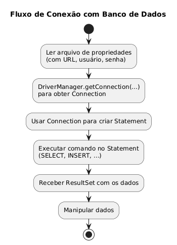
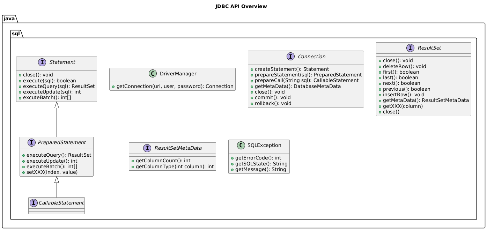

---
layout: default
lesson: Roteiro
---

- Por que bancos relacionais continuam relevantes no backend Java
- Fluxo JDBC: driver, `DriverManager`/`DataSource`, `Connection`
- Boas práticas para carregar propriedades e fechar recursos
- Criação e execução de statements (consulta, escrita, procedures)
- Customização de `ResultSet`, metadados e capacidades do SGBD
- Transações e consistência dos dados na prática (commit/rollback)

---
layout: default
lesson: Fundamentos relacionais
---

### Tabelas e SQL

- Dados organizados em tabelas normalizadas, ligadas por chaves primárias/estrangeiras  
- Operações básicas: `SELECT`, `INSERT`, `UPDATE`, `DELETE` + filtragem (`WHERE`), ordenação (`ORDER BY`), junções (`JOIN`)
- Linguagem declarativa → descrevemos *o quê* precisa ser retornado; otimizador gera o plano

```sql
SELECT f.film_id, f.title, c.name AS category
FROM film f
JOIN film_category fc ON fc.film_id = f.film_id
JOIN category c ON c.category_id = fc.category_id
WHERE c.name = 'Comedy'
ORDER BY f.release_year DESC
LIMIT 5;
```

- Entender esquemas e relacionamentos (ver `lectures/examples/14-jdbc/doc/postgresql-sequence.png`) simplifica o desenho das consultas

---
layout: default
lesson: Driver e fluxo de conexão
---



1. A aplicação faz load do driver específico (PostgreSQL, MySQL, etc.)
2. `DriverManager` (ou um `DataSource` de pool) media a criação de `Connection`
3. A conexão entrega objetos `Statement`/`PreparedStatement` para executar SQL
4. O SGBD responde com `ResultSet` ou contagem de linhas

Boas práticas:
- Dependências JDBC no *classpath* (Maven/Gradle) + `db.properties` ou variáveis de ambiente para credenciais
- Teste de conectividade isolado antes de habilitar operações de escrita
- Documente requisitos (driver version, string de conexão) no repositório

---
layout: default
lesson: Configuração segura
---

```java
// DvdRentalApp.java
Properties props = new Properties();
try (var input = Files.newInputStream(Paths.get("db.properties"))) {
    props.load(input);
}

String url = props.getProperty("url");
String user = props.getProperty("user");
String password = props.getProperty("password");

try (Connection conn = DriverManager.getConnection(url, user, password)) {
    System.out.println("Conectado!");
}
```

- `Properties` evita *hardcode* de segredos; versionar somente `db.properties.sample`
- Use `try-with-resources` desde a abertura da conexão → fechamento garantido
- Em produção, prefira `DataSource` com pool (HikariCP, DBCP) e segredos em cofre/ENV

---
layout: default
lesson: Gerenciando recursos
---

- JDBC expõe interfaces autocloseable (`Connection`, `Statement`, `ResultSet`)
- `try-with-resources` encadeado elimina *finally* verboso e previne *leaks*
- Em APIs com latência/volume, configure `setNetworkTimeout`, `setReadOnly`, `setAutoCommit`
- Sequência típica:
  1. Abre conexão
  2. Prepara statement
  3. Executa
  4. Processa `ResultSet`
  5. *Commit*/*rollback* se necessário

```java
try (Connection conn = dataSource.getConnection();
     PreparedStatement ps = conn.prepareStatement(SQL)) {
    // ...
} catch (SQLException ex) {
    log.error("Erro JDBC", ex);
}
```

---
layout: default
lesson: Statements no JDBC
---

```java
// Trechos de PreparedStatementSelectDemo.java
String sql = """
    SELECT actor_id, first_name, last_name
    FROM actor
    WHERE last_name = ?
""";

try (PreparedStatement ps = conn.prepareStatement(sql)) {
    ps.setString(1, "Chase");
    try (ResultSet rs = ps.executeQuery()) {
        while (rs.next()) {
            System.out.printf("%s %s%n",
                rs.getString("first_name"),
                rs.getString("last_name"));
        }
    }
}
```

- `Statement`: útil para comandos simples, sem parâmetros (evite concatenar texto)
- `PreparedStatement`: SQL pré-compilado, parâmetros tipados (`setInt`, `setBigDecimal`, etc.)
- `CallableStatement`: invocação de procedures/functions (`call gerar_relatorio(?, ?)`), leitura de parâmetros OUT
- `executeQuery` → `ResultSet`; `executeUpdate` → número de linhas; `execute` → múltiplos resultados

---
layout: default
lesson: Processando ResultSet
---

- Iteração com `next()` → traz cada linha em ordem
- Customize o cursor ao criar o statement:
  - `ResultSet.TYPE_SCROLL_INSENSITIVE` para navegar (`previous`, `absolute`)
  - `ResultSet.CONCUR_UPDATABLE` para atualizar linhas diretamente
- Paginação eficiente: `stmt.setFetchSize(50)` + `LIMIT/OFFSET` na consulta

```java
try (PreparedStatement ps = conn.prepareStatement(
        sql,
        ResultSet.TYPE_SCROLL_INSENSITIVE,
        ResultSet.CONCUR_READ_ONLY)) {
    ps.setString(1, categoria);
    try (ResultSet rs = ps.executeQuery()) {
        rs.afterLast();
        while (rs.previous()) {
            // leitura invertida
        }
    }
}
```

- `JdbcRowSet` (exemplo `RowSetJdbcRowSetTest.java`) encapsula `ResultSet` desconectado e serializável

---
layout: default
lesson: Metadados e capacidades
---



```java
try (Statement stmt = conn.createStatement();
     ResultSet rs = stmt.executeQuery("SELECT * FROM film LIMIT 1")) {

    ResultSetMetaData meta = rs.getMetaData();
    int columns = meta.getColumnCount();
    for (int i = 1; i <= columns; i++) {
        System.out.printf("%s (%s)%n",
            meta.getColumnName(i),
            meta.getColumnTypeName(i));
    }
}
```

- `ResultSetMetaData`: nomes, tipos SQL, nulabilidade → útil para gerar tabelas dinâmicas ou logs
- `DatabaseMetaData`: capacidades do driver/SGBD (transações suportadas, palavras reservadas, catálogos)
- `ParameterMetaData`: útil ao construir SQL dinâmico validando tipos antes de setar parâmetros

---
layout: default
lesson: Transações e atomicidade
---

```java
try (Connection conn = DriverManager.getConnection(url, user, password)) {
    conn.setAutoCommit(false);

    atualizarEstoque(conn);
    registrarHistorico(conn);

    conn.commit();
} catch (SQLException ex) {
    conn.rollback(); // garantir consistência
}
```

- `autoCommit=true` (padrão) executa cada statement como transação isolada → desative quando precisar agrupar
- Sempre realize `commit` explícito ou `rollback` no `catch`/`finally`
- Defina nível de isolamento conforme necessidade (`READ COMMITTED`, `SERIALIZABLE`)
- Log de auditoria (`demo/dvdrentalapp/audit.log`) ajuda a validar se operações múltiplas foram persistidas corretamente

---
layout: default
lesson: Checklist e referências
---

**Checklist**
- [ ] Connection string e driver no classpath
- [ ] `db.properties` (ou variáveis) carregado via `Properties`
- [ ] Statements parametrizados e resultados tratados
- [ ] Recursos fechados e transações controladas
- [ ] Metadados e capacidades documentados para o time

**Referências**
- Oracle. *JDBC Developer Guide*, 2024.
- PostgreSQL Global Development Group. *JDBC Driver Manual*, versão 42.
- Exemplos completos em `lectures/examples/14-jdbc/src` e diagramas em `lectures/examples/14-jdbc/doc`.

---
layout: backcover
---
